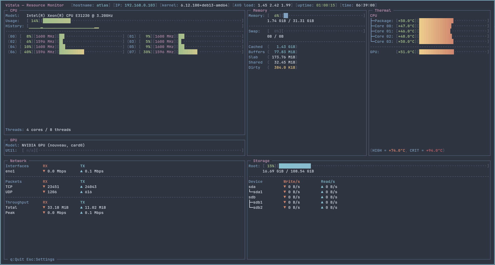
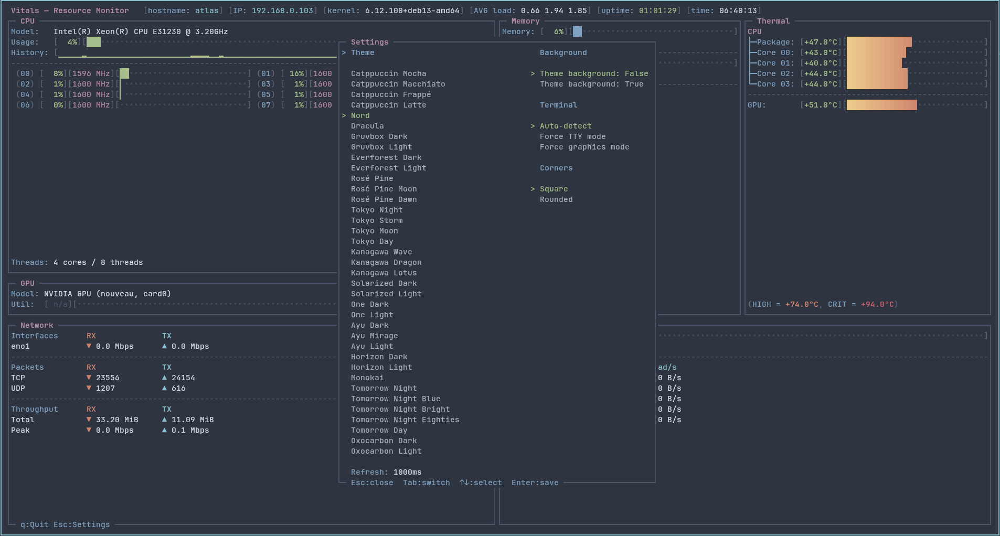

<h1 align="center">Vitals</h1>
<h3 align="center">A terminal resource monitor for Linux built with notcurses.</h3>

<div align="center">

[](https://en.cppreference.com/w/cpp/20)
[](LICENSE)
[](https://kernel.org)
[](https://cmake.org/)
[](https://github.com/dankamongmen/notcurses)

[](https://github.com/rebootless/vitals/actions/workflows/build-debian-12.yml)
[](https://github.com/rebootless/vitals/actions/workflows/build-debian-13.yml)
[](https://github.com/rebootless/vitals/actions/workflows/build-ubuntu-22.04.yml)
[](https://github.com/rebootless/vitals/actions/workflows/build-ubuntu-24.04.yml)

</div>

<table align="center">
  <tr>
    <td width="50%">
      
    </td>
    <td width="50%">
      
    </td>
  </tr>
</table>

## ⚡ Installation

### Quick Install

Install the latest version with a single command:

```bash
bash <(curl -fsSL https://raw.githubusercontent.com/rebootless/vitals/main/install.sh)
```

The installer automatically:

* Installs the required build dependencies
* Clones the notcurses source
* Builds the project
* Installs `vitals` to `/usr/local/bin`
* Installs the required libraries to `/usr/local/lib`

Safe to run multiple times.

<details>
<summary align="center"><b>Build from Source</b> <i>(click to expand)</i></summary>

Clone the repository:

```bash
git clone https://github.com/rebootless/vitals.git
cd vitals
````

Prepare the build environment:

```bash
chmod +x setup.sh
./setup.sh
```

Build:

```bash
cmake -B build -DCMAKE_BUILD_TYPE=Release -DUSE_PANDOC=OFF
cmake --build build -j$(nproc)
```

Install:

```bash
sudo cmake --install build
echo "/usr/local/lib" | sudo tee /etc/ld.so.conf.d/usr_local_lib.conf
sudo ldconfig
```

</details>

<details>
<summary align="center"><b>Run Without Installing</b> <i>(click to expand)</i></summary>

```bash
git clone https://github.com/rebootless/vitals.git
cd vitals

chmod +x setup.sh
./setup.sh

cmake -B build -DCMAKE_BUILD_TYPE=Release -DUSE_PANDOC=OFF
cmake --build build -j$(nproc)

LD_LIBRARY_PATH="$(pwd)/build/notcurses" ./build/vitals
```

</details>

## 📊 Panels

| Panel | Data source | What it shows |
| :--- | :--- | :--- |
| **CPU** | `/proc/stat`, cpufreq | CPU usage, per-core activity, frequencies, history |
| **GPU** | DRM sysfs, hwmon, `nvidia-smi` | Utilization, VRAM, temperature, power |
| **Memory** | `/proc/meminfo` | RAM and swap usage |
| **Network** | `/proc/net/dev` | Per-interface RX/TX throughput |
| **Storage** | `/proc/diskstats`, `statvfs` | Filesystem usage and disk I/O |
| **Thermal** | `/sys/class/thermal`, `/sys/class/hwmon` | CPU, GPU, and motherboard sensors |

> [!NOTE]
> The GPU panel is displayed only when a supported device is detected. Otherwise, the CPU panel expands to use the available space.

## ⌨️ Controls

| Key | Action |
| :--- | :--- |
| `q` | Quit |
| `Esc` | Open the settings menu |
| `Tab` | Select the next option |
| `↑` / `↓` | Change the selected value |
| `Enter` | Save changes and close |
| `Esc` *(in settings)* | Discard changes and close |

## 📋 Requirements

- Linux (kernel ≥ 4.x)
- GCC or Clang with C++20 support
- CMake ≥ 3.14
- Internet access (required to download notcurses during setup)
- Debian 12 / 13 or Ubuntu 22.04 / 24.04

## 📄 License

<p align="center">
  Licensed under the <strong>GNU General Public License v3.0</strong>. See the <a href="LICENSE">LICENSE</a> file for details.
</p>
